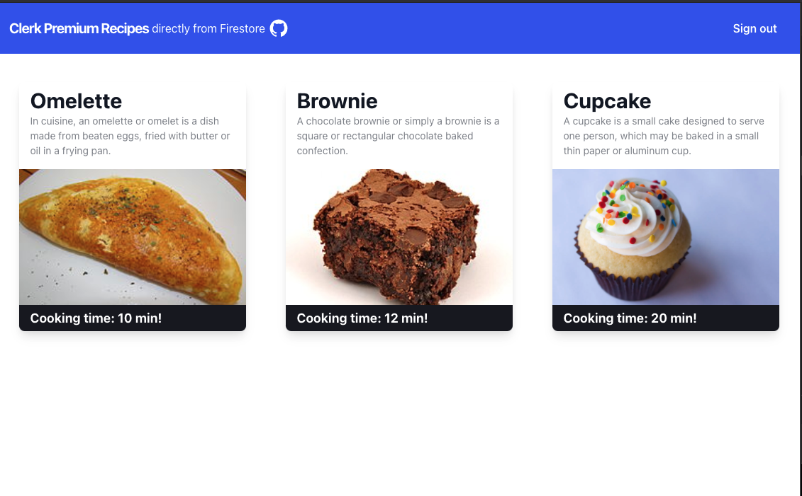

# Clerk - Firebase example repo

This repo shows an example use case for how you can setup Firebase with [Clerk](https://clerk.dev) as a custom authentication provider.

## Premium Recipes App

The **Premium Recipes App** allows only authenticated users to add their favorite recipes on the site to be shared with all other logged in members.

The app is live at https://fir-clerk.web.app/. Check it out!

## Under the hood

This example app uses:

- [Clerk](https://clerk.dev) as an authentication provider.
- [Cloud Firestore](https://firebase.google.com/products/firestore) for data storage.

Reading the `/recipes` collection is only possible for authenticated users based on Firebase rules.

## Where the magic happens

The Clerk integration works by providing a custom authentication token to the Firebase `signInWithCustomToken` auth method. The only thing you need to do on the application level can be seen at [the useRecipes file](./client/hooks/useRecipes.ts#16).

To get a better understanding of the integration, you can check out our [documentation](https://docs.clerk.dev/frontend/integrations/firebase) on the integration.

## Running the starter

To run the example locally you need to:

1. Sign up for a Clerk account at http://clerk.dev/.
2. Setup the required Clerk Frontend API variable from you Clerk project as shown at [the example env file](./.env.example).
3. Replace the Firebase [configuration file](./config/firebase.web.ts) with you own project settings file.
4. Check the instructions on how to setup your Firebase project for a similar setup at the specific [setup document](./docs/firebase_setup.md).
5. `yarn` to install the required dependencies.
6. `yarn dev` and you are good to go.

## Contact

If you have any specific use case or anything you would like to ask, please reach out!
