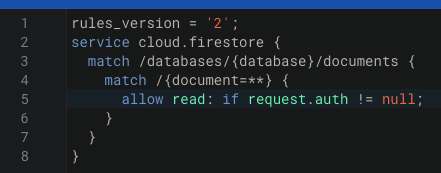

## Firebase project setup

For the example to work correctly for your project you need to:

### 1. Enable Firebase Auth

To do that just go to the Authentication section of your Firebase project at https://console.firebase.google.com/.

### 2. Create the required collection and rules

Setup your `recipes` collection, and add some documents with the schema shown at the [types file](../client/types/recipes.ts).

An example for rules which would only allow authenticated collection reads:

